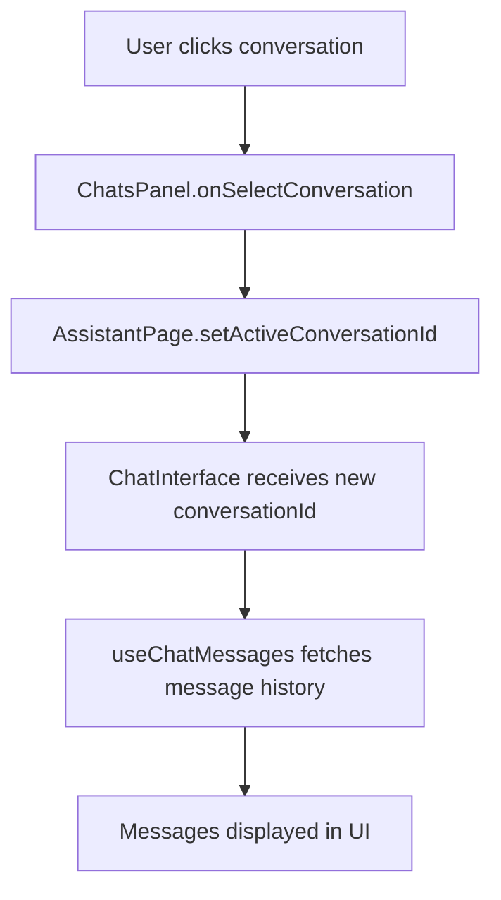
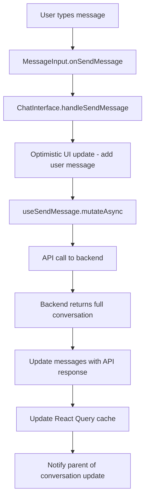

# Chat Interface Architecture Documentation

## Overview

The AudiScope Assistant chat interface is a React-based conversational UI that enables users to interact with an AI assistant for medical training and assessment insights. The architecture follows modern React patterns with React Query for state management, TypeScript for type safety, and a clean separation of concerns.

## Architecture Components

### 1. Core Components Structure

```
app/dashboard/assistant/page.tsx        # Main page container
├── components/assistant/chats-panel.tsx        # Left sidebar with conversation list
├── components/assistant/chat-interface.tsx     # Main chat interface
├── components/assistant/message.tsx            # Individual message component
├── components/assistant/message-input.tsx     # Message input component
└── components/assistant/knowledge-base-panel.tsx # Right sidebar (commented out)
```

### 2. Data Flow Architecture

```
Backend API ←→ React Query Hooks ←→ React Components ←→ User Interface
```

#### API Layer (`lib/knowlege-base.service.ts`)
- **sendMessage**: Sends user messages and receives full conversation history
- **getChats**: Retrieves list of user's conversations
- **getChatById**: Gets individual chat metadata
- **getChatMessages**: Gets message history for a specific chat
- **uploadDocumentAWS**: Handles knowledge base document uploads

#### React Query Layer (`hooks/use-knowledge-base.ts`)
- **useChats**: Manages conversation list state and caching
- **useChat**: Manages individual chat metadata
- **useChatMessages**: Manages message history for conversations
- **useSendMessage**: Handles message sending with optimistic updates
- **useKnowledgeBaseConfig**: Provides environment configuration

#### Component Layer
- **AssistantPage**: Top-level container managing conversation selection
- **ChatInterface**: Core chat UI with message display and input
- **ChatsPanel**: Conversation list with search and management
- **Message**: Individual message rendering with regeneration
- **MessageInput**: Text input with file upload capabilities

## Data Flow Patterns

### 1. Conversation Selection Flow



### 2. Message Sending Flow



### 3. New Conversation Flow

```mermaid
graph TD
    A[User clicks 'New' button] --> B[ChatInterface.handleNewConversation]
    B --> C[Clear local messages]
    C --> D[Call onNewConversation callback]
    D --> E[AssistantPage.setActiveConversationId(null)]
    E --> F[ChatInterface shows welcome screen]
    F --> G[User sends first message]
    G --> H[Backend creates new conversation]
    H --> I[Update activeConversationId with new chat ID]
```

## Key Design Patterns

### 1. Optimistic Updates
The interface provides immediate feedback by adding user messages to the UI before the API response:

```typescript
// Add user message immediately
const userMessage: MessageType = {
  id: `temp-user-${Date.now()}`,
  content: content,
  sender: "user",
  timestamp: new Date(),
}
setMessages(prev => [...prev, userMessage])

// Replace with real API response when available
if (response.messages && response.messages.length > 0) {
  setMessages(convertApiMessagesToUI(response.messages))
}
```

### 2. React Query Cache Management
The system maintains consistent cache states across multiple queries:

```typescript
onSuccess: (data: ChatResponse, variables) => {
  // Update chat list
  queryClient.invalidateQueries({ queryKey: ['chats'] });
  
  // Update specific chat metadata
  queryClient.setQueryData(['chat', data.chat.id], data.chat);
  
  // Update messages cache with new conversation history
  queryClient.setQueryData(['chat-messages', data.chat.id], data.messages);
}
```

### 3. Separation of Concerns
- **Data Layer**: React Query hooks handle all server state
- **Component Layer**: Focus on UI rendering and user interactions
- **Service Layer**: Abstract API communication details
- **Type Layer**: TypeScript interfaces ensure type safety

### 4. Responsive Design
The layout adapts to different screen sizes:
- Mobile: Collapsible panels with overlay
- Desktop: Fixed panel layout
- Auto-close panels on mobile when selecting conversations

## State Management Strategy

### 1. Server State (React Query)
- Conversation lists
- Individual chat metadata
- Message histories
- Loading and error states
- Background refetching and caching

### 2. Local Component State
- UI-specific states (panel visibility, search queries)
- Optimistic message updates
- Scroll positions and references
- Form input states

### 3. Parent-Child Communication
- Props-based callbacks for conversation updates
- Event handlers for user actions
- Controlled component patterns for conversation selection

## Error Handling Strategy

### 1. Network Errors
```typescript
catch (error) {
  console.error('Error sending message:', error)
  // Replace optimistic message with error
  const errorMessage: MessageType = {
    id: `error-${Date.now()}`,
    content: "Sorry, I encountered an error processing your message. Please try again.",
    sender: "assistant",
    timestamp: new Date(),
  }
  setMessages(prev => [...prev.slice(0, -1), errorMessage])
}
```

### 2. React Query Error Boundaries
- Automatic retry logic for failed requests
- Stale-while-revalidate caching strategy
- Background error recovery

### 3. User Experience
- Clear error messages in chat
- Graceful degradation when backend is unavailable
- Loading states prevent user confusion

## Type Safety Architecture

### 1. API Types
```typescript
interface ChatMessage {
  id?: string
  chat_id?: string
  content: string
  role: "user" | "assistant"
  timestamp?: string
  metadata?: Record<string, any>
  tenant_id?: string
}

interface Chat {
  id: string
  title: string
  user_id: string
  tenant_id: string
  knowledge_base_id?: string
  aws_session_id?: string
  created_at: string
  updated_at: string
  metadata?: Record<string, any>
}
```

### 2. UI Types
```typescript
interface MessageType {
  id: string
  content: string
  sender: "user" | "assistant"
  timestamp: Date
  isLoading?: boolean
}
```

### 3. Component Props
Strong typing for all component interfaces ensures compile-time safety and better developer experience.

## Performance Optimizations

### 1. React Query Caching
- 5-minute cache for conversation lists
- 2-minute cache for individual chats and messages
- Background refetching for data freshness
- Request deduplication

### 2. Component Optimizations
- useRef for scroll management
- Minimal re-renders through proper dependency arrays
- Efficient list rendering with React keys

### 3. Network Optimizations
- Optimistic updates reduce perceived latency
- Batch API calls where possible
- Intelligent cache invalidation

## Security Considerations

### 1. Authentication
- JWT-based authentication for all API calls
- Automatic token refresh on expiration
- User context from token payload

### 2. Data Validation
- TypeScript compile-time checks
- Runtime validation of API responses
- Sanitization of user inputs

### 3. Error Information Exposure
- Generic error messages to users
- Detailed logging for debugging (development only)
- No sensitive information in client-side errors

## Future Enhancement Points

### 1. Message Persistence
- Currently, message history is only available via API
- Consider implementing local storage for offline viewing
- Message search and filtering capabilities

### 2. Real-time Features
- WebSocket integration for live conversations
- Typing indicators
- Read receipts

### 3. Advanced UI Features
- Message threading
- Rich media support
- Voice message input
- Conversation export

### 4. Performance Scaling
- Virtual scrolling for long conversations
- Message pagination
- Image and file preview optimization

## Development Guidelines

### 1. Adding New Features
1. Define TypeScript interfaces first
2. Create API service functions following existing patterns
3. Add React Query hooks with proper caching
4. Implement UI components with error handling
5. Update this documentation

### 2. Testing Strategy
- Unit tests for utility functions
- Integration tests for React Query hooks
- Component testing with React Testing Library
- E2E tests for complete user flows

### 3. Code Organization
- Keep components focused on single responsibilities
- Extract reusable logic into custom hooks
- Maintain consistent naming conventions
- Document complex business logic

## Troubleshooting Guide

### Common Issues

1. **Messages not loading when switching conversations**
   - Check if `useChatMessages` hook is properly enabled
   - Verify conversation ID is being passed correctly
   - Check React Query cache invalidation

2. **Optimistic updates not working**
   - Ensure temporary message IDs are unique
   - Check error handling removes optimistic messages
   - Verify API response replaces temp messages

3. **Conversations not appearing in sidebar**
   - Check `useChats` hook is fetching data
   - Verify user authentication and permissions
   - Check API endpoint availability

4. **New conversation flow broken**
   - Verify `onNewConversation` callback is working
   - Check conversation ID state management
   - Ensure backend creates new conversation on first message

This architecture provides a robust, scalable foundation for the AudiScope Assistant chat interface while maintaining excellent user experience and developer productivity.