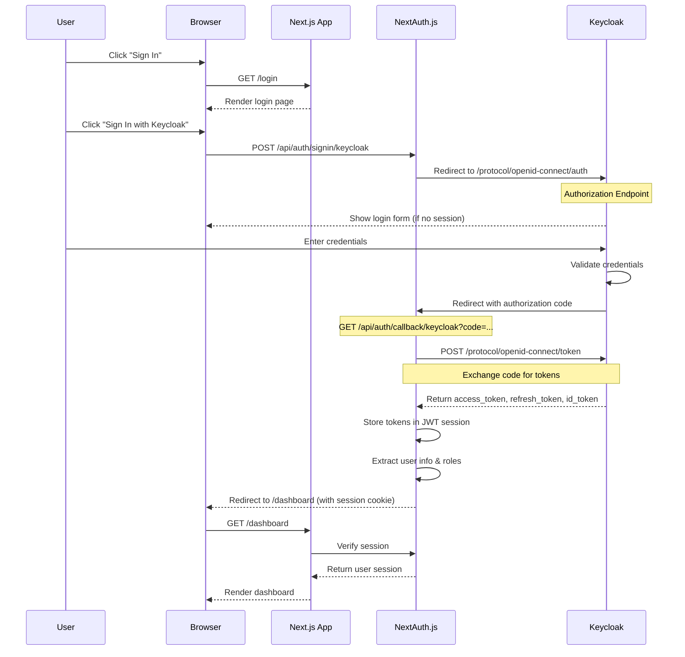
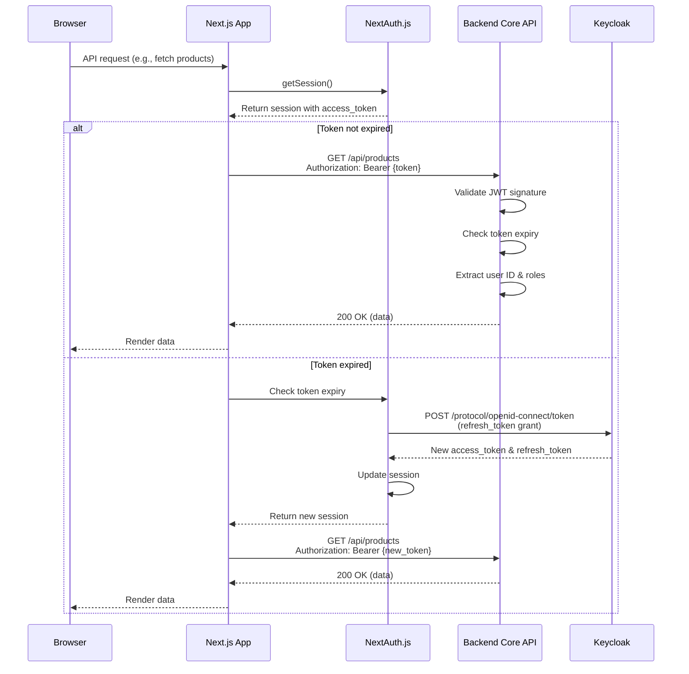
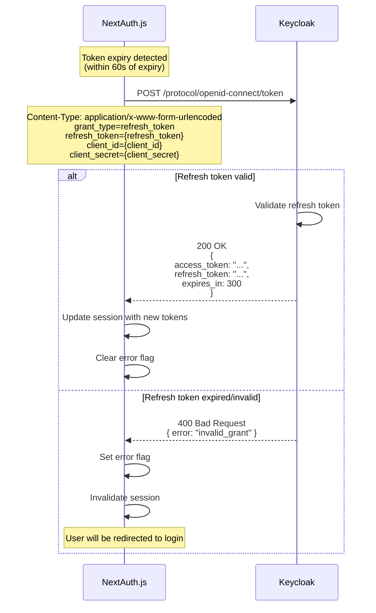
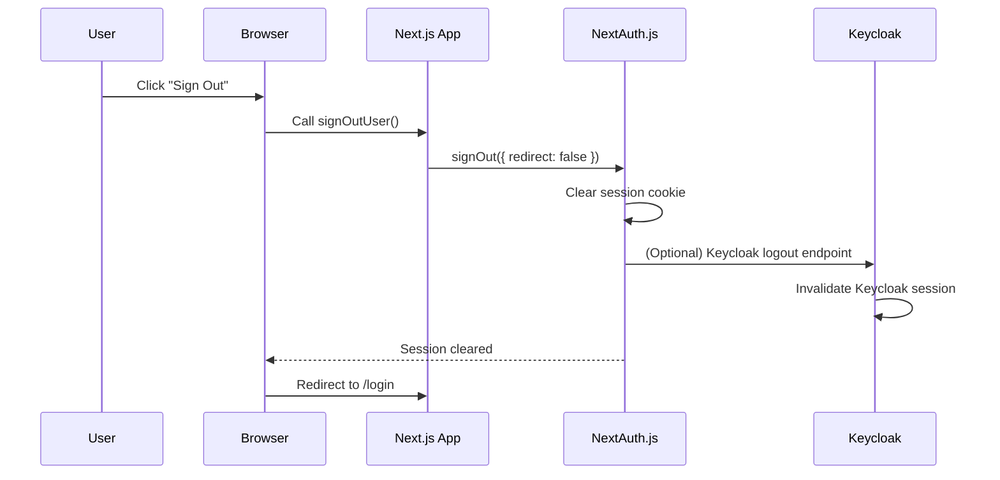
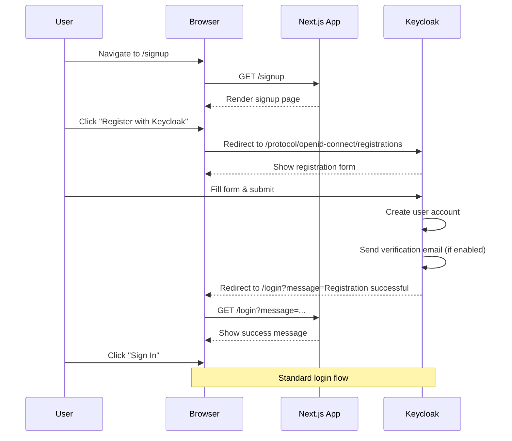

# Keycloak Authentication System

## Overview

AudiScope uses Keycloak as its identity provider with NextAuth.js v4 for OAuth2/OIDC authentication. This document describes the authentication architecture, flows, and integration details.

## Architecture

### Components

```
┌─────────────────────────────────────────────────────────────────────┐
│                          User Browser                                │
│  ┌──────────────────────┐         ┌──────────────────────────────┐ │
│  │  Next.js Frontend    │         │    NextAuth.js Client        │ │
│  │  - React Components  │◄────────┤    - Session Management      │ │
│  │  - Auth Provider     │         │    - Token Refresh           │ │
│  └──────────┬───────────┘         └──────────────┬───────────────┘ │
└─────────────┼──────────────────────────────────────┼────────────────┘
              │                                      │
              │ OAuth2 Redirect                      │ API Calls
              │                                      │
┌─────────────▼──────────────────────────────────────▼────────────────┐
│                      Next.js Backend (Server)                        │
│  ┌──────────────────────────────────────────────────────────────┐  │
│  │         /api/auth/[...nextauth]/route.ts                     │  │
│  │  - NextAuth.js v4 Server                                     │  │
│  │  - Keycloak Provider (imports from lib/auth.ts)              │  │
│  │  - Token Management (Access + Refresh)                       │  │
│  │  - JWT Callbacks (defined in lib/auth.ts)                    │  │
│  └──────────┬─────────────────────────────────────┬─────────────┘  │
└─────────────┼─────────────────────────────────────┼────────────────┘
              │                                      │
              │ OAuth2 Token Exchange                │ JWT Validation
              │                                      │
┌─────────────▼──────────────────────┐  ┌───────────▼────────────────┐
│     Keycloak Identity Server       │  │    Backend Core API        │
│  - User Authentication             │  │  - JWT Token Validation    │
│  - User Registration               │  │  - Role-Based Access       │
│  - Password Management             │  │  - API Endpoints           │
│  - Role & Attribute Management     │  │                            │
│  - Token Issuance (JWT)            │  │                            │
└────────────────────────────────────┘  └────────────────────────────┘
```

### Technology Stack

- **NextAuth.js v4** - Authentication library for Next.js
- **Keycloak** - Open-source Identity and Access Management (IAM)
- **OAuth2 / OIDC** - Industry-standard authentication protocols
- **JWT** - JSON Web Tokens for stateless authentication
- **Next.js 15** - React framework with App Router
- **Next.js Middleware** - Server-side route protection

### Auth Configuration Files

The authentication system is organized across two key files:

**1. `/lib/auth.ts`** - Primary authentication configuration
- Exports `authOptions: NextAuthOptions` used by NextAuth
- Configures Keycloak provider with client credentials
- Defines JWT callback for token refresh logic
- Defines session callback for user session structure
- Handles token expiry and automatic refresh (60s buffer)
- Extracts roles and custom attributes from Keycloak JWT
- Implements Keycloak logout on signout event

**2. `/app/api/auth/[...nextauth]/route.ts`** - NextAuth API route handler
- Imports `authOptions` from `/lib/auth.ts`
- Creates NextAuth handler with: `NextAuth(authOptions)`
- Exports GET and POST handlers for OAuth2 flow
- Handles Keycloak OAuth2 callbacks

This separation keeps the configuration centralized and testable, while the route handler remains minimal.

## Authentication Flows

### 1. Login Flow (Authorization Code Flow)



**Flow Steps:**

1. User clicks "Sign In" button
2. NextAuth redirects to Keycloak authorization endpoint
3. Keycloak shows login form (if no active session exists)
4. User enters credentials
5. Keycloak validates and redirects back with authorization code
6. NextAuth exchanges code for tokens (access, refresh, ID)
7. NextAuth creates encrypted JWT session cookie
8. User is redirected to dashboard with active session

### 2. API Request Flow (with JWT Token)



**Flow Steps:**

1. Browser makes API request
2. Next.js extracts access token from session
3. Token validity is checked (60-second buffer before expiry)
4. If expired, NextAuth automatically refreshes using refresh token
5. API request is made with Bearer token in Authorization header
6. Backend validates JWT signature and extracts claims
7. Response is returned to browser

### 3. Token Refresh Flow



**Refresh Logic:**

- Tokens are refreshed **60 seconds before expiry** to avoid edge cases
- Refresh tokens are typically valid for 30 days (configurable in Keycloak)
- Failed refresh results in session invalidation and redirect to login
- Successful refresh updates both access and refresh tokens

### 4. Logout Flow



**Flow Steps:**

1. User clicks "Sign Out"
2. NextAuth clears encrypted session cookie
3. (Optional) Keycloak session can be invalidated via logout endpoint
4. User is redirected to login page
5. Next login will show Keycloak login form

### 5. Registration Flow



## JWT Token Structure

### Access Token Claims

Keycloak issues JWT access tokens with the following claims:

```json
{
  "exp": 1705420800,           // Expiration timestamp
  "iat": 1705420500,           // Issued at timestamp
  "jti": "uuid",               // JWT ID
  "iss": "http://localhost:8080/realms/audiscope",  // Issuer
  "sub": "uuid",               // Subject (user ID)
  "typ": "Bearer",             // Token type
  "azp": "audiscope-web",      // Authorized party (client)
  "session_state": "uuid",     // Session identifier

  // User attributes
  "email": "user@example.com",
  "email_verified": true,
  "name": "John Doe",
  "preferred_username": "john.doe",

  // Custom attributes
  "organisation_id": "org-uuid",

  // Roles
  "realm_access": {
    "roles": ["owner", "admin", "editor"]
  },
  "roles": ["owner", "admin", "editor"]
}
```

### NextAuth Session Structure

NextAuth stores the following in encrypted session cookies:

```typescript
{
  user: {
    id: string,                    // From token.sub
    email: string,                 // From token.email
    name: string,                  // From token.name
    organisationId?: string,       // From token.organisation_id
    roles?: string[]               // From token.roles or realm_access.roles
  },
  accessToken: string,             // Keycloak access token
  error?: string                   // "RefreshAccessTokenError" if refresh failed
}
```

## Role-Based Access Control (RBAC)

### Role Hierarchy

AudiScope uses a multi-role system where users can have multiple roles:

```
┌─────────────────────────────────────────────────────────────┐
│  Role Hierarchy (Level-based permissions)                   │
├─────────────────────────────────────────────────────────────┤
│  owner   (5) - Full system access                           │
│  admin   (4) - Administrative access                        │
│  manager (3) - Team management                              │
│  editor  (2) - Content creation/editing                     │
│  user    (1) - Standard access                              │
│  viewer  (0) - Read-only access                             │
└─────────────────────────────────────────────────────────────┘
```

### Role Utilities

The `/lib/rbac-utils.ts` provides helper functions:

```typescript
import { hasRole, hasAnyRole, hasAllRoles, Role, isOwnerOrAdmin } from '@/lib/rbac-utils'

// Check single role
if (hasRole(user, Role.ADMIN)) {
  // User is admin
}

// Check any role (OR logic)
if (hasAnyRole(user, [Role.OWNER, Role.ADMIN])) {
  // User is either owner OR admin
}

// Check all roles (AND logic)
if (hasAllRoles(user, [Role.EDITOR, Role.USER])) {
  // User has both editor AND user roles
}

// Permission helpers
if (isOwnerOrAdmin(user)) {
  // Show admin panel
}

if (canManageContent(user)) {
  // Allow content editing
}

if (canManageTeam(user)) {
  // Allow team management
}
```

### Role Mapping in Keycloak

Roles are configured in Keycloak and included in JWT tokens via client mappers:

1. **Create Realm Roles** in Keycloak Admin Console
   - Navigate to: `Realm Settings → Roles`
   - Create roles: `owner`, `admin`, `manager`, `editor`, `user`, `viewer`

2. **Configure Role Mapper**
   - Navigate to: `Clients → audiscope-web → Client Scopes → audiscope-web-dedicated → Mappers`
   - Create mapper:
     - Name: `roles`
     - Mapper Type: `User Realm Role`
     - Token Claim Name: `roles`
     - Claim JSON Type: `String`
     - **Multivalued: ON** ✅
     - Add to ID token: ON
     - Add to access token: ON
     - Add to userinfo: ON

## Environment Configuration

### Frontend Environment Variables

```bash
# .env.local (Next.js Frontend)

# Keycloak Authentication (Server-side - NOT exposed to browser)
KEYCLOAK_ISSUER=http://localhost:8080/realms/audiscope
KEYCLOAK_CLIENT_ID=audiscope-web
KEYCLOAK_CLIENT_SECRET=your-client-secret-here

# NextAuth Configuration
NEXTAUTH_URL=http://localhost:3000
NEXTAUTH_SECRET=your-nextauth-secret-here

# Backend Core API Configuration
CORE_API_URL=http://localhost:5002/api

# Keycloak Public Configuration (Client-side - exposed to browser)
NEXT_PUBLIC_KEYCLOAK_URL=http://localhost:8080
NEXT_PUBLIC_KEYCLOAK_REALM=audiscope
NEXT_PUBLIC_KEYCLOAK_CLIENT_ID=audiscope-web
```

**Security Notes:**
- `KEYCLOAK_CLIENT_SECRET` is **server-only** (no `NEXT_PUBLIC_` prefix)
- Never expose client secrets to the browser
- Use strong, randomly generated secrets for `NEXTAUTH_SECRET`
- `NEXT_PUBLIC_*` variables are embedded in client bundle and exposed to browser
- Only `KEYCLOAK_URL`, `KEYCLOAK_REALM`, and `KEYCLOAK_CLIENT_ID` need to be public for client-side redirects
- `CORE_API_URL` is used by Next.js rewrites to proxy `/api/core/*` requests to the backend

**Environment Validation:**
The application validates required environment variables at startup using `lib/env-validation.ts`. Missing variables will cause the app to fail fast with clear error messages.

### Backend Environment Variables (Core API)

```bash
# Backend expects to validate Keycloak JWT tokens

KEYCLOAK_ISSUER=http://localhost:8080/realms/audiscope
KEYCLOAK_REALM=audiscope
KEYCLOAK_CLIENT_ID=audiscope-web

# JWT validation settings
JWT_ALGORITHM=RS256
JWT_AUDIENCE=audiscope-web
```

## Security Considerations

### Token Security

1. **Access Token Lifetime**: Short-lived (5 minutes recommended)
2. **Refresh Token Lifetime**: Long-lived (30 days recommended)
3. **Token Storage**: Encrypted HTTP-only cookies (handled by NextAuth)
4. **HTTPS Required**: Always use HTTPS in production

### Session Security

1. **Session Strategy**: JWT-based (stateless)
2. **Session MaxAge**: 30 days
3. **Cookie Attributes**:
   - `httpOnly: true` - Prevents XSS attacks
   - `secure: true` - HTTPS only (production)
   - `sameSite: lax` - CSRF protection

### CORS Configuration

Keycloak client must have correct redirect URIs configured:

```
Valid Redirect URIs:
- http://localhost:3000/*
- http://localhost:3000/api/auth/callback/keycloak
- https://yourdomain.com/*
- https://yourdomain.com/api/auth/callback/keycloak

Valid Post Logout Redirect URIs:
- http://localhost:3000/*
- https://yourdomain.com/*
```

### PKCE (Proof Key for Code Exchange)

NextAuth automatically uses PKCE for OAuth2 flows:

- Generates `code_verifier` and `code_challenge`
- Prevents authorization code interception attacks
- Required for public clients

### Route Protection

**Server-Side Middleware (CRITICAL)**

The application uses Next.js middleware for server-side route protection. With NextAuth v4, the middleware uses `getToken()` from `next-auth/jwt`:

```typescript
// middleware.ts
import { NextRequest, NextResponse } from 'next/server'
import { getToken } from "next-auth/jwt"

export default async function middleware(request: NextRequest) {
  const pathname = request.nextUrl.pathname

  // CRITICAL: Skip all NextAuth routes immediately to prevent infinite loops
  if (pathname.startsWith('/api/auth/')) {
    return NextResponse.next()
  }

  // Run NextAuth authentication check using getToken for middleware
  const token = await getToken({
    req: request,
    secret: process.env.NEXTAUTH_SECRET
  })

  // Check if accessing protected routes
  const isProtectedRoute = pathname.startsWith('/dashboard')

  if (isProtectedRoute && !token) {
    const loginUrl = new URL('/login', request.url)
    return NextResponse.redirect(loginUrl)
  }

  return NextResponse.next()
}

export const config = {
  matcher: [
    /*
     * Match all request paths except:
     * - _next/static (static files)
     * - _next/image (image optimization)
     * - favicon.ico, icon.svg (favicons)
     * - Common static file extensions
     */
    '/((?!_next/static|_next/image|favicon.ico|icon.svg|.*\\.(?:png|jpg|jpeg|gif|svg|ico|webp|woff|woff2|ttf|eot)).*)',
  ]
}
```

**Key Points:**
- Uses `getToken()` from `next-auth/jwt` (NextAuth v4 middleware pattern)
- Early return for `/api/auth/*` prevents infinite loops
- Comprehensive matcher pattern excludes static assets automatically
- Redirects unauthenticated users to `/login` for dashboard routes
- Note: The actual implementation also includes tenant resolution logic

**Protection Layers:**

1. **Middleware (Server-side)** - Primary security layer
   - Protects all `/dashboard/*` routes
   - Protects API routes except `/api/auth/*`
   - Runs before page rendering
   - Cannot be bypassed by disabling JavaScript

2. **AuthGuard (Client-side)** - UX layer
   - Provides loading states
   - Handles client-side redirects
   - Improves user experience
   - Secondary to middleware protection

**Important:** Never rely solely on client-side protection (AuthGuard). Always use middleware for security-critical routes.

## Error Handling

### Authentication Errors

1. **RefreshAccessTokenError**
   - Occurs when refresh token is expired/invalid
   - Session is invalidated
   - User is redirected to login page

2. **AuthenticationError** (from API)
   - Thrown by `lib/api-utils.ts` when JWT is invalid
   - Handled by React Query error boundaries
   - Triggers automatic sign-out and redirect to login

3. **Session Errors**
   - Detected in `auth-provider.tsx`
   - User object set to `null`
   - AuthGuard redirects to login

### Debugging

Enable debug logging in browser console:

```javascript
// In browser console
window.debugJWT()

// Output:
// 🎫 Access Token (raw): eyJhbGciOiJSUzI1NiIsInR5cCI6IkpXVCJ9...
// 📦 JWT Claims: { sub: "uuid", email: "user@example.com", ... }
// 🔍 Custom Attributes:
//   user.id: uuid
//   user.organisationId: org-uuid
//   user.roles: ["admin", "editor"]
```

## API Integration

### API Proxy via Next.js Rewrites

The application uses **Next.js rewrites** (not a custom API route) to proxy frontend requests to the backend Core API. This approach automatically forwards all headers including the Authorization header.

**Configuration in `next.config.mjs`:**

```javascript
async rewrites() {
  return [
    {
      source: '/api/core/:path*',
      destination: process.env.CORE_API_URL + '/:path*'
    }
  ]
}
```

**How it works:**

```
Frontend Request:  fetch('/api/core/v1/products', { headers: { Authorization: 'Bearer ...' }})
                   ↓
Next.js Rewrite:   → http://backend-api.com/api/v1/products (headers preserved)
                   ↓
Backend Response:  ← Returns data
                   ↓
Frontend:          ← Receives response
```

**Benefits:**
- ✅ No custom proxy code needed
- ✅ Automatic header forwarding (including Authorization)
- ✅ Better performance (direct Next.js handling)
- ✅ Simpler maintenance
- ✅ Works with all HTTP methods (GET, POST, PUT, DELETE, PATCH)

**Environment Variable:**
- `CORE_API_URL` - Backend API base URL (e.g., `http://localhost:5002/api`)

### Making Authenticated Requests (Client-Side)

The recommended pattern for making authenticated requests from Client Components uses `getSession()` from NextAuth to extract the access token.

**Pattern used in service files** (`lib/service/product.service.ts`):

```typescript
import { getSession } from 'next-auth/react'
import { handleApiResponse } from '../api-utils'
import { AuthenticationError } from '../auth-error'

async function makeClientAuthRequest(url: string, options: RequestInit = {}): Promise<Response> {
  // Get current session
  const session = await getSession()
  const token = (session as any)?.accessToken

  if (!token) {
    throw new AuthenticationError("No access token available")
  }

  // Make request with Authorization header
  const headers = {
    'Authorization': `Bearer ${token}`,
    'Content-Type': 'application/json',
    ...options.headers,
  }

  const response = await fetch(url, {
    ...options,
    headers,
  })

  // Handle auth errors
  if (response.status === 401 || response.status === 403) {
    throw new AuthenticationError('Session expired. Please sign in again.', response.status)
  }

  return response
}

// Example usage
const response = await makeClientAuthRequest('/api/core/v1/products', {
  method: 'GET'
})
const data = await handleApiResponse(response)
```

**React Query integration** (recommended):

```typescript
import { useQuery } from '@tanstack/react-query'

const { data, error, isLoading } = useQuery({
  queryKey: ['products'],
  queryFn: async () => {
    const response = await makeClientAuthRequest('/api/core/v1/products')
    return handleApiResponse(response)
  }
})
```

**Key Points:**
- Use `/api/core/...` paths which are proxied to backend via Next.js rewrites
- Always include `Authorization: Bearer ${token}` header
- Handle 401/403 errors by throwing `AuthenticationError`
- Use `handleApiResponse()` for consistent error handling

### Making Authenticated Requests (Server-Side)

Use these utilities in Server Components, Server Actions, and API Routes:

```typescript
import { getServerAuthHeaders, getServerUserId, requireServerAuth } from '@/lib/auth-utils-server'

// Option 1: Get auth headers for API requests
const headers = await getServerAuthHeaders()
const response = await fetch('https://api.example.com/data', { headers })

// Option 2: Get current user ID
const userId = await getServerUserId()

// Option 3: Require authentication (throws if not authenticated)
const session = await requireServerAuth()
// If this line is reached, user is authenticated

// Option 4: Get session (returns null if not authenticated)
import { getServerSession } from '@/lib/auth-utils-server'
const session = await getServerSession()
if (!session) {
  // Handle unauthenticated case
}
```

**Example: Server Component**

```typescript
// app/dashboard/profile/page.tsx
import { getServerSession } from '@/lib/auth-utils-server'
import { redirect } from 'next/navigation'

export default async function ProfilePage() {
  const session = await getServerSession()

  if (!session?.user) {
    redirect('/login')
  }

  return (
    <div>
      <h1>Welcome, {session.user.name}</h1>
      <p>Email: {session.user.email}</p>
      <p>Roles: {session.user.roles?.join(', ')}</p>
    </div>
  )
}
```

**Example: API Route**

```typescript
// app/api/protected/route.ts
import { NextRequest, NextResponse } from 'next/server'
import { requireServerAuth, getServerAuthHeaders } from '@/lib/auth-utils-server'

export async function GET(request: NextRequest) {
  try {
    // Require authentication
    const session = await requireServerAuth()

    // Make authenticated request to backend
    const headers = await getServerAuthHeaders()
    const response = await fetch('https://backend-api.com/data', { headers })
    const data = await response.json()

    return NextResponse.json(data)
  } catch (error) {
    return NextResponse.json({ error: 'Unauthorized' }, { status: 401 })
  }
}
```

### Backend JWT Validation (Go Example)

```go
import (
    "github.com/golang-jwt/jwt/v5"
    "github.com/lestrrat-go/jwx/v2/jwk"
)

// Validate Keycloak JWT token
func ValidateKeycloakToken(tokenString string) (*jwt.Token, error) {
    // Fetch JWKS from Keycloak
    jwksURL := "http://localhost:8080/realms/audiscope/protocol/openid-connect/certs"
    set, err := jwk.Fetch(context.Background(), jwksURL)
    if err != nil {
        return nil, err
    }

    // Parse and validate token
    token, err := jwt.Parse(tokenString, func(token *jwt.Token) (interface{}, error) {
        // Get key from JWKS
        keyID, ok := token.Header["kid"].(string)
        if !ok {
            return nil, errors.New("missing kid in token header")
        }

        key, ok := set.LookupKeyID(keyID)
        if !ok {
            return nil, errors.New("key not found in JWKS")
        }

        var rawKey interface{}
        if err := key.Raw(&rawKey); err != nil {
            return nil, err
        }

        return rawKey, nil
    })

    if err != nil {
        return nil, err
    }

    // Validate claims
    claims := token.Claims.(jwt.MapClaims)

    // Check issuer
    if claims["iss"] != "http://localhost:8080/realms/audiscope" {
        return nil, errors.New("invalid issuer")
    }

    // Check audience
    if claims["azp"] != "audiscope-web" {
        return nil, errors.New("invalid audience")
    }

    // Extract user info
    userID := claims["sub"].(string)
    email := claims["email"].(string)
    roles := claims["roles"].([]interface{})

    return token, nil
}
```

## Migration from AWS Cognito

### Changes Made

1. **Removed Dependencies**
   - `aws-amplify` package removed from `package.json`
   - `lib/auth-config.ts` deleted
   - All AWS Cognito environment variables deprecated

2. **Updated Files**
   - `lib/auth.ts` - NEW: Centralized NextAuth v4 configuration with authOptions
   - `app/api/auth/[...nextauth]/route.ts` - Route handler (imports from lib/auth.ts)
   - `components/providers/auth-provider.tsx` - Wraps NextAuth SessionProvider
   - `lib/api-utils.ts` - Uses NextAuth session instead of Amplify
   - `lib/service/*.service.ts` - Updated to use getSession() pattern for API requests
   - `middleware.ts` - Uses getToken() from next-auth/jwt for auth checks
   - `next.config.mjs` - Uses Next.js rewrites for API proxying (not custom route)
   - `app/login/page.tsx` - OAuth redirect instead of custom form
   - `app/signup/page.tsx` - Redirects to Keycloak registration
   - `app/forgot-password/page.tsx` - Redirects to Keycloak password reset

3. **Type Definitions**
   - `types/next-auth.d.ts` - Extended NextAuth types
   - Removed singular `role` property
   - Standardized on `roles: string[]` array

### Backward Compatibility

AWS Cognito variables are preserved (commented out) in `.env.local` for reference:

```bash
# AWS Cognito (DEPRECATED - Migrated to Keycloak)
# DEPRECATED: NEXT_PUBLIC_AWS_REGION=eu-west-1
# DEPRECATED: NEXT_PUBLIC_USER_POOL_ID=eu-west-1_xxxxx
# DEPRECATED: NEXT_PUBLIC_USER_POOL_CLIENT_ID=xxxxxx
```

### Recent Improvements (2024)

**Security & Architecture Enhancements:**

1. **Server-Side Route Protection** ✅
   - Added `/middleware.ts` with NextAuth middleware
   - All `/dashboard/*` and API routes protected at server level
   - Cannot be bypassed by disabling JavaScript

2. **Simplified AuthProvider** ✅
   - Removed non-functional Cognito-style methods
   - Clean OAuth2-appropriate interface with 4 methods:
     - `signInUser()` - Redirect to Keycloak
     - `signOutUser()` - Clear session
     - `registerUser()` - Redirect to Keycloak registration
     - `resetPassword()` - Redirect to Keycloak password reset

3. **Server-Side Auth Utilities** ✅
   - Created `/lib/auth-utils-server.ts`
   - Functions for Server Components, Server Actions, and API Routes
   - `getServerAuthHeaders()`, `getServerUserId()`, `requireServerAuth()`

4. **Environment Variable Validation** ✅
   - Added `/lib/env-validation.ts`
   - Validates required env vars at startup
   - Fail-fast with clear error messages

5. **Removed Deprecated Code** ✅
   - Cleaned up AWS Cognito references
   - Removed deprecated environment variables
   - Consistent auth usage across all pages

6. **OAuth2 Behavior** ✅
   - Removed aggressive `prompt: "login"` parameter
   - Respects existing Keycloak sessions (SSO)
   - Better user experience for multi-application environments

7. **Centralized Auth Configuration** ✅
   - Created `/lib/auth.ts` for centralized NextAuth v4 configuration
   - Separates auth logic from route handler
   - Token refresh logic with 60-second buffer
   - Keycloak logout on signout

8. **API Proxy via Next.js Rewrites** ✅
   - Uses Next.js rewrites instead of custom API route
   - Automatic header forwarding (including Authorization)
   - Configuration in `next.config.mjs`
   - Proxies `/api/core/*` to `CORE_API_URL/*`

## Testing

### Local Development Setup

1. **Start Keycloak**:
   ```bash
   cd core-api
   docker-compose up keycloak
   ```

2. **Configure Keycloak**:
   - Access: http://localhost:8080
   - Login: admin / admin
   - Create realm: `audiscope`
   - Create client: `audiscope-web`
   - Configure roles and mappers (see above)

3. **Start Next.js**:
   ```bash
   bun dev
   ```

4. **Test Flow**:
   - Visit: http://localhost:3000/login
   - Click "Sign In with Keycloak"
   - Should redirect to Keycloak login
   - After login, should redirect back to dashboard
   - Check browser console: `window.debugJWT()`

### Testing Checklist

- [ ] Login redirects to Keycloak
- [ ] Successful login redirects to dashboard
- [ ] User stays logged in (no auto-signout loop)
- [ ] Logout clears session
- [ ] Token refresh works automatically
- [ ] Signup redirects to Keycloak registration
- [ ] Password reset redirects to Keycloak
- [ ] Roles are included in session
- [ ] API requests include Bearer token
- [ ] Session persists across browser refreshes

## Troubleshooting

### Issue: Redirects to login immediately after authentication

**Cause**: Backend API returns 401/403, triggering auto-signout in QueryProvider.

**Solution**: Temporarily disabled in `query-provider.tsx` until backend supports Keycloak tokens.

### Issue: "Session expired" error on every page load

**Cause**: Token refresh failing or session callback returning error.

**Solution**: Check server logs for refresh token errors. Verify Keycloak issuer URL is correct.

### Issue: Roles not appearing in session

**Cause**: Keycloak role mapper not configured correctly.

**Solution**:
1. Ensure "Multivalued" is enabled in mapper
2. Check `window.debugJWT()` output for roles
3. Verify user has roles assigned in Keycloak

### Issue: Client secret error

**Cause**: Client secret not configured or incorrect.

**Solution**: Regenerate client secret in Keycloak and update `.env.local`.

## References

- [NextAuth.js Documentation](https://next-auth.js.org/)
- [Keycloak Documentation](https://www.keycloak.org/documentation)
- [OAuth 2.0 RFC](https://datatracker.ietf.org/doc/html/rfc6749)
- [JWT RFC](https://datatracker.ietf.org/doc/html/rfc7519)
- [PKCE RFC](https://datatracker.ietf.org/doc/html/rfc7636)
